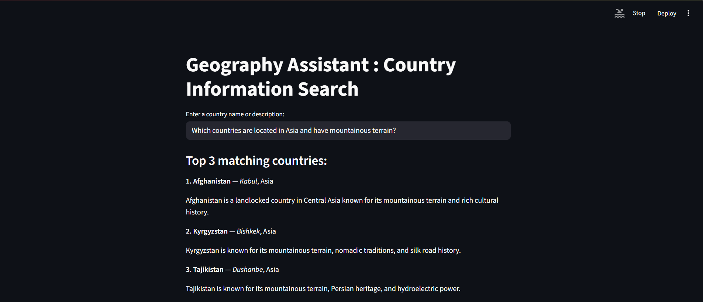
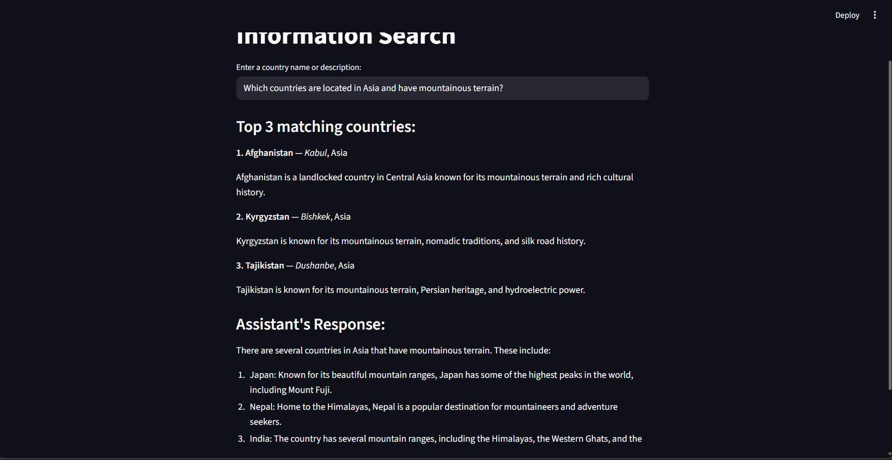
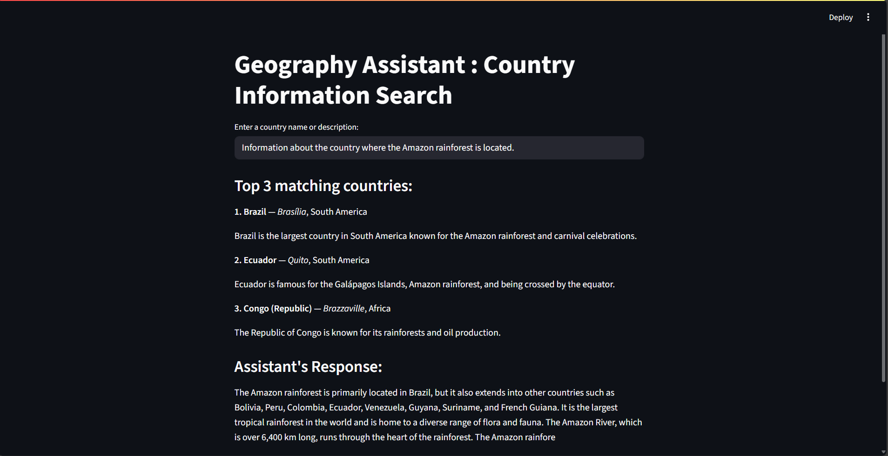

# Geography Assistant: Country Information Search

A Retrieval-Augmented Generation (RAG) application that provides intelligent country information search using semantic similarity and local language models.

> **Guided Project**: This project was developed as part of the **"Introduction to Retrieval Augmented Generation (RAG)"** guided project on Coursera. The implementation demonstrates practical application of RAG concepts learned during the guided project.

## 🌍 Overview

This project implements a RAG system that combines:
- **Vector Search**: Uses sentence transformers to create embeddings of country descriptions
- **Semantic Retrieval**: Qdrant vector database for similarity search
- **Local LLM**: LLaMA.cpp for generating contextual responses
- **Web Interface**: Streamlit for user-friendly interaction

## 📁 Project Structure

```
Rag-project/
├── app.py                 # Main Streamlit application
├── countries.csv          # Country dataset with descriptions
├── embedding.ipynb       # Jupyter notebook for embedding experiments
├── README.md            # This file
└── llama.cpp/           # LLaMA.cpp library (for local LLM inference)
    ├── examples/        # Example implementations
    ├── tools/          # Various tools and utilities
    ├── models/         # Model templates and vocabularies
    └── ...            # Additional LLaMA.cpp components
```

## 🚀 Features

- **Semantic Search**: Find countries based on natural language descriptions
- **Top-3 Results**: Returns the most relevant countries for each query
- **Local LLM Integration**: Uses LLaMA.cpp for generating contextual responses
- **Interactive Web Interface**: Clean Streamlit UI for easy interaction
- **Vector Database**: In-memory Qdrant for fast similarity search

## 🛠️ Technology Stack

- **Python 3.x**
- **Streamlit** - Web application framework
- **Sentence Transformers** - Text embedding generation
- **Qdrant** - Vector database for similarity search
- **LLaMA.cpp** - Local language model inference
- **OpenAI Python Client** - API client for local LLM
- **Pandas** - Data manipulation

## 📦 Installation

### Prerequisites

1. **Python Environment**: Ensure you have Python 3.8+ installed
2. **LLaMA.cpp Server**: Set up a local LLaMA.cpp server (see setup instructions below)

### Setup Instructions

1. **Clone the repository**:
   ```bash
   git clone <your-repo-url>
   cd Rag-project
   ```

2. **Create a virtual environment**:
   ```bash
   python -m venv .venv
   source .venv/bin/activate  # On Windows: .venv\Scripts\activate
   ```

3. **Install dependencies**:
   ```bash
   pip install streamlit pandas qdrant-client sentence-transformers openai
   ```

4. **Set up LLaMA.cpp server**:
   ```bash
   # Clone LLaMA.cpp repository
   git clone https://github.com/ggerganov/llama.cpp.git
   cd llama.cpp
   
   # Build the project
   mkdir build && cd build
   cmake ..
   make
   
   # Download a model (example with 7B model)
   # You'll need to download a GGUF format model
   # Place it in the models/ directory
   
   # Start the server
   ./server -m models/llama-2-7b-chat.gguf -c 2048 --host 0.0.0.0 --port 8080
   ```

5. **Update the server URL** in `app.py`:
   ```python
   # Change this line to match your server setup
   base_url="http://192.168.1.8:8080/v1"
   ```

## 🎯 Usage

### Running the Application

1. **Start the LLaMA.cpp server** (if not already running):
   ```bash
   cd llama.cpp/build
   ./server -m models/your-model.gguf -c 2048 --host 0.0.0.0 --port 8080
   ```

2. **Launch the Streamlit app**:
   ```bash
   streamlit run app.py
   ```

3. **Open your browser** and navigate to `http://localhost:8501`

### Using the Application

1. **Enter a query**: Type a country name or description in the text input
2. **View results**: The app will show:
   - Top 3 matching countries with their details
   - AI-generated response about the queried country
3. **Explore**: Try different queries like:
   - "Country with pyramids"
   - "Island nation in the Pacific"
   - "European country famous for wine"

## 📸 Screenshots

### Main Interface

*The main application interface showing the search input and results display*

### Search Results

*Example search results showing top 3 matching countries and AI-generated response*

### Query Examples

*Various query examples demonstrating the semantic search capabilities*

### Guided Project Certificate

*Certificate of completion for "Introduction to Retrieval Augmented Generation (RAG)" guided project on Coursera*

## 📊 Dataset

The `countries.csv` file contains information about 195 countries including:
- **Country name**
- **Capital city**
- **Continent**
- **Description**: Rich text descriptions used for semantic search

## 🔧 Configuration

### Model Configuration

- **Embedding Model**: `all-MiniLm-L6-v2` (384-dimensional embeddings)
- **Vector Distance**: Cosine similarity
- **Search Results**: Top 3 matches
- **LLM Parameters**:
  - Max tokens: 100
  - Temperature: 0.7
  - Top-p: 0.9

### Server Configuration

Update the following in `app.py`:
```python
base_url="http://YOUR_SERVER_IP:8080/v1"
```

## 🧪 Development

### Jupyter Notebook

The `embedding.ipynb` file contains experimental code for:
- Loading and preprocessing the dataset
- Creating embeddings with sentence transformers
- Setting up Qdrant vector database
- Testing semantic search functionality
- Integrating with local LLM

### Customization

1. **Add more countries**: Update `countries.csv` with additional entries
2. **Change embedding model**: Modify the SentenceTransformer model in `app.py`
3. **Adjust search parameters**: Modify the search limit and similarity threshold
4. **Customize LLM prompts**: Update the system and user prompts in the chat completion

## 🤝 Contributing

1. Fork the repository
2. Create a feature branch
3. Make your changes
4. Test thoroughly
5. Submit a pull request

## 📝 License

This project is licensed under the MIT License - see the LICENSE file for details.

## 🙏 Acknowledgments

- **Coursera** for the excellent "Introduction to Retrieval Augmented Generation (RAG)" guided project
- **LLaMA.cpp** for local language model inference
- **Sentence Transformers** for text embeddings
- **Qdrant** for vector database functionality
- **Streamlit** for the web interface framework

## 🔗 Related Links

- [LLaMA.cpp Documentation](https://github.com/ggerganov/llama.cpp)
- [Sentence Transformers](https://www.sbert.net/)
- [Qdrant Vector Database](https://qdrant.tech/)
- [Streamlit Documentation](https://docs.streamlit.io/)

---

**Note**: This project requires a local LLaMA.cpp server to be running for the language model functionality. Make sure to follow the setup instructions carefully. 